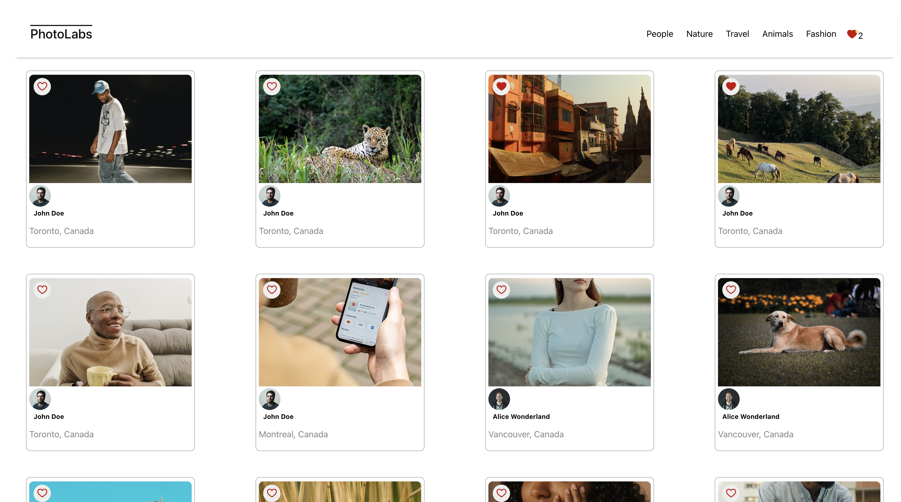

# Photolabs

PhotoLabs is a React-based single-page application (SPA) that allows users to view photos in different contexts.

# Screenshots




## Setup

Install dependencies with `npm install` in each respective `/frontend` and `/backend`.

Note that two different servers will be running during development:
Client-side Webpack development server and
API server to provide photo data

## Technical Specifications with API References

React
Create React App
Webpack
Babel
Express

## [Frontend] Running Webpack Development Server

```sh
cd frontend
npm start
```

## [Backend] Running Backend Servier

Read `backend/readme` for further setup details.

```sh
cd backend
npm start
```
